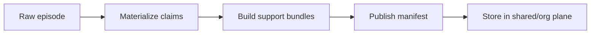
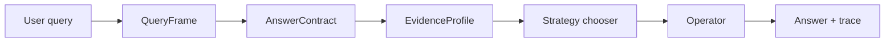

# ai_knot_newgen_14042025_3_multi_agent

Дата: 2026-04-14  
Фокус: будущий multi-agent режим поверх новой contract-first архитектуры `ai-knot`.

Этот документ — не MVP-план и не benchmark-specific заметка.  
Это целевая архитектура для multi-agent режима, который живёт поверх:

- raw-first substrate;
- typed evidence / claims;
- answer contract / evidence profile;
- deterministic operator core;
- shared provenance and trust.

Опорные файлы и текущие точки расширения:

- `src/ai_knot/pool.py`
- `src/ai_knot/_pool_recall.py`
- `src/ai_knot/multi_agent/router.py`
- `src/ai_knot/multi_agent/facets.py`
- `src/ai_knot/multi_agent/recall_service.py`
- `src/ai_knot/multi_agent/assembly.py`
- `src/ai_knot/multi_agent/bridge.py`
- `src/ai_knot/multi_agent/canonical.py`
- `src/ai_knot/multi_agent/scoring.py`
- `src/ai_knot/multi_agent/expertise.py`
- `src/ai_knot/multi_agent/insights.py`
- `src/ai_knot/storage/base.py`
- `src/ai_knot/storage/sqlite_storage.py`
- `src/ai_knot/storage/postgres_storage.py`
- `tests/eval/benchmark/BENCHMARK.md`
- `tests/eval/benchmark/backends/ai_knot_multi_agent_backend.py`
- `tests/eval/benchmark/scenarios/s10_ma_mesi_cas.py`
- `tests/eval/benchmark/scenarios/s11_ma_mesi_sync.py`
- `tests/eval/benchmark/scenarios/s13_concurrent_writers.py`
- `tests/eval/benchmark/scenarios/s14_trust_drift.py`
- `tests/eval/benchmark/scenarios/s16_knowledge_relay.py`
- `tests/eval/benchmark/scenarios/s17_self_correction.py`
- `tests/eval/benchmark/scenarios/s18_trust_calibration.py`
- `tests/eval/benchmark/scenarios/s19_incident_reconstruction.py`
- `tests/eval/benchmark/scenarios/s23_adversarial_noise.py`
- `tests/eval/benchmark/scenarios/s26_sparse_assembly.py`

---

## 1. Текущая точка и почему она уже не хватает

Сейчас `SharedMemoryPool` — это уже не просто “общая память”, а достаточно богатая multi-agent подсистема:

- `publish()` копирует активные факты из private KB агента в namespace `__shared__`;
- `promote()` переводит факты в tier `pool` / `org`;
- `gc_pool()` экспирует старые pool facts по TTL;
- `sync_dirty()` и `sync_slot_deltas()` обеспечивают MESI-like pull между агентами;
- `get_trust()` делает автоматическую trust-оценку по published / used / quick invalidations;
- `SharedPoolRecallService` в `src/ai_knot/multi_agent/recall_service.py` уже умеет facet-aware retrieval, coverage-aware assembly, expertise routing и bridge retrieval;
- `ClaimFamilyResolver` в `src/ai_knot/multi_agent/canonical.py` уже делает canonical resolution и dedup на основе content similarity;
- `AgentExpertiseIndex` в `src/ai_knot/multi_agent/expertise.py` даёт route-before-retrieve;
- `TeamInsightStore` в `src/ai_knot/multi_agent/insights.py` уже намекает на team-level reuse.

Но вся эта система всё ещё семантически построена вокруг **“разделённой выдачи фактов”**.  
Это хороший foundation, но это не yet полноценная **shared evidence algebra**.

Главный предел текущей схемы:

- shared pool остаётся “переносом фактов”, а не “контрактным транспортом доказательств”;
- routing и assembly решают retrieval quality, но ещё не задают полноценную семантику shared answer;
- `publish / sync / promote` пока ближе к памяти как storage, чем к памяти как product capability;
- multi-agent semantics всё ещё частично завязаны на flat recall, хотя новая архитектура хочет перейти к answer contract first.

---

## 2. Как новая архитектура меняет multi-agent semantics

Новая архитектура меняет не только форматы, но и **значение** multi-agent взаимодействия.

### 2.1. Было: shared fact exchange

Старая семантика выглядит так:

1. каждый агент хранит private KB;
2. полезные факты публикуются в shared pool;
3. другие агенты делают `sync_dirty()` / `sync_slot_deltas()`;
4. поиск в shared pool идёт через retrieval path;
5. relevance / trust / diversity улучшают качество top-k.

Это уже полезно, но по сути это **“общая полка фактов”**.

### 2.2. Станет: shared evidence substrate

В новой архитектуре shared pool становится не полкой, а **субстратом доказательств**, который умеет:

- хранить сырой исходный материал;
- материализовать атомарные claims;
- строить support bundles;
- выдавать manifests публикации;
- поддерживать restore / rebuild;
- транспортировать не просто facts, а provenance-bound evidence packages.

То есть multi-agent semantics смещаются:

- от “agent A поделился фактом”;
- к “agent A опубликовал manifest доказательств и прав на их использование”;
- к “agent B может потреблять это evidence под контракт ответа”;
- к “org memory получает промоутнутые стабильные claims и bundles, а не случайные текстовые фрагменты”.

### 2.3. Локальное / shared / org перестают быть просто tier labels

В новой модели:

- `local` — volatile, fast, agent-private, high freshness, low sharing cost;
- `shared` — validated cross-agent evidence, provenance-first, trust-weighted;
- `org` — promoted stable memory, idempotent, versioned, restoreable, audit-friendly.

Это уже не просто уровни хранения.  
Это три разных **контракта на смысл**:

- `local` отвечает на “что знает конкретный агент прямо сейчас”;
- `shared` отвечает на “что можно безопасно разделить и объяснить другим агентам”;
- `org` отвечает на “что достаточно стабильно, чтобы стать shared organizational memory”.

### 2.4. Переосмысление `publish`, `sync`, `promote`

Сейчас:

- `publish()` = copy private facts into `__shared__`;
- `sync_dirty()` = pull changed shared facts;
- `promote()` = поднять tier у pool fact;
- `gc_pool()` = TTL-based expiry.

В целевой архитектуре:

- `publish()` = publish manifest, а не “копия строк”;
- `sync_dirty()` = pull manifests / deltas, а не raw text blobs;
- `promote()` = change distribution scope and policy, not just `memory_tier`;
- `gc_pool()` = policy-driven archiving, not only age-based deletion.

### 2.5. Query semantics тоже меняются

В новой архитектуре query больше не означает “запроси pool facts”.

Query pipeline становится:

1. `QueryFrame` определяет тип ответа;
2. `AnswerContract` определяет режим исполнения;
3. `EvidenceProfile` определяет силу support / contra / recency / dispersion;
4. strategy chooser выбирает operator;
5. operator решает answer package;
6. renderer формирует текст и trace.

Это важный semantic shift:  
multi-agent retrieval подчиняется **контракту ответа**, а не просто “кто что знает”.

---

## 3. Как это изменит продуктово

### 3.1. Что получит пользователь

Пользователь увидит не “поиск по общей памяти”, а несколько качественно новых режимов:

- **shared current state** — что команда / агентная система / проект знает прямо сейчас;
- **multi-source answer** — ответ, который собран из нескольких агентов и объясним;
- **timeline answer** — кто, что и когда менял, без перескоков между датами;
- **confidence-aware answer** — `yes / no / uncertain` с объяснением support vs contra;
- **coverage-aware answer** — не один факт, а полный список / полный набор / все shards;
- **org memory answer** — ответ по стабильной корпоративной памяти, а не по случайному top-k.

### 3.2. Где это особенно полезно

#### Incident response

Несколько агентов одновременно наблюдают инцидент:

- один агент видит alert;
- второй — deployment change;
- третий — database migration;
- четвёртый — rollback command.

Новая multi-agent архитектура должна уметь:

- слить это в один evidence bundle;
- сохранить provenance каждого агента;
- показать timeline;
- объяснить конфликтующие сигналы;
- дать answer contract для “что случилось и что мы знаем наверняка”.

#### Team knowledge

Команда постоянно задаёт вопросы:

- кто владеет сервисом;
- где лежит runbook;
- какой у сервиса current owner;
- какой SDK использовали в проекте;
- кто недавно менял policy;
- какой scope у решения.

В новой модели это не “поиск по чату”, а:

- shared evidence;
- org promotion;
- stable answer surfaces;
- trust-weighted reuse.

#### Multi-agent workflow

Если есть агенты-специалисты:

- DevOps-agent;
- Product-agent;
- Research-agent;
- Legal-agent;
- Support-agent;

то новая архитектура позволяет им не просто “обменяться текстом”, а:

- публиковать доказательства;
- подписывать manifests;
- ссылаться на origin / scope / validity;
- получать ответы через контракт, а не через случайный top-k.

### 3.3. Что это даёт продуктово

Продуктовый выигрыш не только в точности:

- меньше галлюцинаций;
- меньше повторных вопросов;
- меньше “перечитай весь чат”;
- легче доверять shared answers;
- выше повторное использование одного и того же evidence;
- лучше enterprise readiness;
- проще строить audit trail;
- легче продавать memory как инфраструктурную capability.

---

## 4. Инфраструктурная обвязка

Это центральная часть документа.

### 4.1. Storage: что меняется

Текущий storage в `src/ai_knot/storage/base.py`, `sqlite_storage.py`, `postgres_storage.py` уже умеет хранить `Fact`-объекты и снапшоты.  
Но целевая multi-agent архитектура должна добавить ещё несколько слоёв:

#### A. Raw plane

Храним:

- raw turn / raw episode;
- timestamps;
- speaker / agent;
- source session / thread / conversation;
- raw content;
- possibly attachments / media refs;
- provenance chain.

#### B. Claims plane

Храним нормализованные claims:

- `StateClaim`;
- `RelationClaim`;
- `EventClaim`;
- `DescriptorClaim`;
- `IntentClaim`.

Здесь принципиально важно:

- claims не должны быть answer-shaped;
- claims должны быть rebuildable from raw;
- claims должны иметь origin / validity / source refs;
- claims должны жить независимо от конкретного benchmark.

#### C. Bundles plane

Храним support bundles:

- `EntityTopicBundle`;
- `StateTimelineBundle`;
- `EventNeighborhoodBundle`;
- `RelationSupportBundle`;
- возможно, `ConflictBundle`.

Bundles — это coarse retrieval units, не финальные ответы.

#### D. Manifest plane

Храним manifests публикации / обмена / промоушена.

#### E. Index plane

Храним индексы:

- claim-to-episode;
- bundle-to-claim;
- agent-to-bundle;
- manifest-to-origin;
- trust / freshness / lineage;
- maybe entity-topic shards.

### 4.2. Publish / share: из copy-based в manifest-based

Сейчас `SharedMemoryPool.publish()` делает copy facts в shared namespace.  
В новой архитектуре publish должен превращаться в **manifest publication**.

#### Новый смысл publication

Публикация должна включать:

- origin agent;
- scope;
- policy;
- validity;
- claim refs;
- bundle refs;
- trust snapshot;
- version / parent version;
- publish reason;
- optionally signature / hash.

#### Псевдотип manifest

```python
@dataclass(slots=True)
class PublishManifest:
    manifest_id: str
    origin_agent_id: str
    scope: str              # local/shared/org/project/team/incident
    tier: str               # shared/org/etc
    created_at: datetime
    parent_manifest_id: str | None
    claim_ids: tuple[str, ...]
    bundle_ids: tuple[str, ...]
    source_episode_ids: tuple[str, ...]
    trust_snapshot: float
    policy: dict[str, str]
    checksum: str
```

#### Почему это лучше, чем copy

- легче sync;
- легче restore;
- легче audit;
- легче diff;
- легче promote/demote;
- легче делать concurrency-safe publish.

### 4.3. Share: shared memory как транспорт evidence

Shared memory больше не должен быть “папкой с фактами”.

Он должен быть transport layer для:

- stable claims;
- bundle manifests;
- deltas;
- invalidations;
- promotions;
- cross-agent trust updates.

Иначе говоря, shared memory — это **репозиторий обмена доказательствами**.

### 4.4. Restore / rebuild

Это важный продуктовый блок.

#### Restore

Restore должен восстанавливать:

- raw plane;
- claims plane;
- bundles plane;
- manifests;
- indexes;
- trust state;
- known version markers.

#### Rebuild

Rebuild нужен, когда:

- schema изменилась;
- bundle strategy поменялась;
- retriever policy обновилась;
- claims materializer улучшился;
- trust / decay logic обновился.

#### Практическое правило

- raw — source of truth;
- claims / bundles — materialized views;
- manifests — transactional envelope;
- indexes — disposable and rebuildable.

То есть после restore можно:

1. поднять raw;
2. пересобрать claims;
3. пересобрать bundles;
4. восстановить manifests / indices;
5. пересчитать trust / decay surface.

### 4.5. Transport: как доставлять данные между агентами

Сейчас transport в основном внутри одного процесса / общей storage backend.

В целевой архитектуре transport должен иметь несколько уровней:

- **in-process transport** — быстрый путь для одного процесса;
- **DB-backed transport** — базовый cross-agent path;
- **manifest transport** — публикация в shared/org scopes;
- **delta transport** — lightweight sync для обновлений;
- **event transport** — для future multi-worker or multi-node;
- **async queue / RPC transport** — будущий расширяемый слой.

#### Рекомендуемый принцип

Пусть transport сначала остаётся простым:

- SQLite / Postgres / YAML как physical storage;
- manifest records как logical transport unit;
- idempotent apply.

А уже потом можно думать о внешнем broker.

### 4.6. Как существующие storage backends вписываются

#### `SQLiteStorage`

Сейчас это наиболее естественная база для multi-agent core:

- транзакционность;
- WAL;
- `atomic_update`;
- `save_atomic`;
- `SnapshotCapable`-подобное восстановление.

#### `PostgresStorage`

Подходит для:

- shared team memory;
- multi-process concurrency;
- long-lived org memory;
- restore/rebuild jobs;
- distributed use cases.

#### `YAMLStorage`

Подходит только как:

- dev / debug / human-readable replay;
- local experimentation;
- regression analysis.

Для production multi-agent режима YAML должен быть fallback, не основа.

---

## 5. Как будет работать decay

Decay в новой архитектуре — один из самых важных design points.

Главное правило:

**decay не должен стирать truth; decay должен менять salience, access priority и promotion pressure.**

### 5.1. Local decay

Local memory:

- живёт быстро;
- часто обновляется;
- легко переоценивается;
- может быть шумной;
- должна терять salience быстрее других слоёв.

Что это значит practically:

- старые local claims остаются в истории;
- но retrieval приоритизирует новые local signals;
- stale local evidence становится менее visible;
- локальный agent быстрее забывает scratch-like hypotheses.

### 5.2. Shared decay

Shared memory:

- уже прошла процедуру publication;
- имеет provenance;
- имеет trust snapshot;
- может быть использована другими агентами.

Поэтому shared decay должен учитывать:

- freshness;
- usage / reuse;
- invalidations;
- conflict pressure;
- trust of origin;
- number of corroborating agents.

Shared decay не должен выглядеть как обычный Ebbinghaus-only fade.

Он должен быть ближе к:

- salience decay;
- trust decay;
- conflict decay;
- publish pressure;
- reuse reinforcement.

### 5.3. Org decay

Org memory — это почти всегда стабильная память.

Для org tier:

- truth не decay’ится автоматически;
- decayed может быть только retrieval salience;
- если claim устарел, он демотится или superseded, а не исчезает бесследно;
- invalidation должен сохранять lineage.

Иначе enterprise use case ломается на audit / restore / explainability.

### 5.4. Практическая схема decay

Можно мыслить в трех параметрах:

1. **truth validity**
   - это факт всё ещё истинный?
   - зависит от validity window, supersession, contradiction.

2. **salience**
   - насколько высоко это должно всплывать в retrieval?
   - зависит от recency, usage, trust, coverage, scope.

3. **promotion weight**
   - достойно ли это shared/org promotion?
   - зависит от corroboration, support density, stability.

Это три разных оси.  
Их нельзя смешивать.

### 5.5. Что важно для multi-agent режима

Для multi-agent decay особенно важны:

- cross-agent corroboration;
- quick invalidation;
- repeated support by independent agents;
- adversarial / noisy agents;
- shared vs local asymmetry;
- org promotion hysteresis.

То есть one-agent decay и multi-agent decay — не одно и то же.

---

## 6. Мультипоточность и concurrency model

Это отдельная ось архитектуры.

### 6.1. Что уже есть сейчас

В `src/ai_knot/pool.py` уже есть:

- `_publish_lock` для in-process serialization publish calls;
- `AtomicUpdateCapable` / `save_atomic`;
- `sync_dirty()` на основе high-water mark;
- `sync_slot_deltas()` как lightweight delta pull;
- trust / version tracking;
- `gc_pool()` и `promote()`.

Это хороший фундамент.  
Но целевая архитектура требует более строгой concurrency semantics.

### 6.2. Модель concurrency

Рекомендуемая целевая модель:

- **multi-reader**;
- **single logical writer per manifest namespace**;
- idempotent apply;
- optimistic concurrency with version checks;
- per-agent or per-entity locking where needed;
- replay-safe manifest commits.

### 6.3. Что должно быть concurrency-safe

Конкурентно безопасными должны быть:

- publish manifest;
- manifest dedup;
- promotion / demotion;
- rebuild job;
- restore job;
- trust updates;
- sync dirty / slot deltas;
- bundle recomputation;
- claim supersession.

### 6.4. Где нужен лок

В целевой модели лока не должно быть везде.

Нужно различать:

- **in-process lock** — cheap serialization внутри одного процесса;
- **storage-level atomicity** — SQLite/Postgres transaction semantics;
- **manifest-level CAS** — avoid double publish / double promote;
- **namespace lock** — if two writers touch one shard or one org area;
- **background rebuild lock** — prevent stale rebuild overwrite.

### 6.5. Что делать с текущим `SharedMemoryPool._publish_lock`

Сейчас это полезный guardrail, но в целевой архитектуре он должен стать лишь первым уровнем:

- для single-process dev — достаточно;
- для production — недостаточно;
- нужно добавить storage-level idempotence and manifest CAS.

### 6.6. Race conditions, которые нужно считать first-class

Нужно планировать и тестировать:

- два агента публикуют одинаковый claim одновременно;
- один агент публикует, другой сразу sync’ит;
- publish и gc_pool происходят одновременно;
- restore идёт параллельно с publish;
- promote переводит bundle в org while another writer invalidates it;
- sync_dirty получает stale high-water mark;
- concurrent rebuild overwrites a newer materialization;
- trust recalculation races with invalidation.

### 6.7. Benchmark visibility

В benchmark-режиме concurrency model должна воспроизводиться через:

- `tests/eval/benchmark/scenarios/s13_concurrent_writers.py`;
- `tests/eval/benchmark/scenarios/s10_ma_mesi_cas.py`;
- `tests/eval/benchmark/scenarios/s11_ma_mesi_sync.py`;
- `tests/eval/benchmark/scenarios/s16_knowledge_relay.py`.

То есть concurrency — не абстракция, а проверяемое поведение.

---

## 7. Сценарии и failure modes

### 7.1. Какие сценарии должен покрывать новый multi-agent режим

#### A. Cooperative specialization

Несколько агентов по разным доменам публикуют знания, потом другой агент задаёт cross-domain вопрос.

Что надо уметь:

- собрать facets;
- покрыть все нужные домены;
- удержать provenance;
- не утонуть в generic near-miss facts.

#### B. Incident coordination

Агенты видят разные части одного инцидента.

Что надо уметь:

- восстановить timeline;
- собрать support vs contra;
- учитывать trust;
- быстро синхронизировать dirty deltas;
- не потерять conflicting evidence.

#### C. Self-correction

Агент сам публикует устаревшую информацию, затем получает опровержение.

Что надо уметь:

- видеть quick invalidation;
- уменьшать trust;
- не терять lineage;
- не размножать stale claims.

#### D. Adversarial noise

Часть агентов публикует шум.

Что надо уметь:

- ограничивать влияние noisy publisher;
- снижать trust;
- сохранять corroborated evidence;
- не давать шуму захватить org tier.

#### E. Sparse assembly

Нужно собрать ответ из очень разреженных shards across many agents.

Что надо уметь:

- facet-aware retrieval;
- diversity caps;
- topic-based cluster retrieval;
- bridge retrieval;
- coverage-aware assembly.

### 7.2. Failure modes, которые нужно обязательно покрыть

#### 1. Stale manifest

Manifest опубликовался, но underlying claims обновились.

Риск:

- stale bundle refs;
- invalid provenance;
- mismatch between manifest and materialized storage.

#### 2. Double publish

Один и тот же evidence пакет опубликован дважды разными путями.

Риск:

- duplicate shared memory;
- inflated trust / usage;
- double counting in recall.

#### 3. Split brain между local и shared

Локально claim уже superseded, а shared видит старую версию.

Риск:

- inconsistent answers;
- flicker in sync;
- stale org promotion.

#### 4. Restore during write

Снапшот или rebuild идёт одновременно с publish.

Риск:

- partial state;
- lost manifest;
- inconsistent indexes.

#### 5. Promotion thrash

Объект слишком рано / слишком часто переводится в org.

Риск:

- org pollution;
- too many permanent claims;
- polluted retrieval.

#### 6. Trust oscillation

Trust score слишком дергается от коротких событий.

Риск:

- unstable ranking;
- flapping between agents;
- nondeterministic assembly.

#### 7. Coverage illusion

Assembler показывает high coverage, но answer всё ещё missing key shard.

Риск:

- false confidence;
- benchmark overfitting;
- shallow assembly metrics.

#### 8. Contradiction collapse

Разные агенты дают conflict, а система преждевременно схлопывает их в один answer.

Риск:

- loss of uncertainty;
- hidden evidence;
- incorrect org claims.

### 7.3. Что тестировать в этих сценариях

Для каждого сценария должны быть тесты на:

- lineage;
- trust;
- coverage;
- idempotence;
- restoreability;
- concurrency stability;
- deterministic trace.

---

## 8. Отличия от конкурентов и product differentiation

### 8.1. Что делают конкуренты

По общей конкурентной картине (`research/competitors/00_comparison_table.md` и отдельные competitor notes):

- `Mem0` — сильный graph / memory extraction direction;
- `Letta` — agentic self-search / memory as agentic loop;
- `Zep` — temporal graph memory;
- `Cognee` — graph / LLM-to-Cypher / search over knowledge graph;
- `Supermemory` — generic memory stack;
- `Hindsight` — temporal graph / spreading activation / dynamic memory graph;
- `memvid` — session / retrieval-centric memory with good coverage traits.

### 8.2. Где мы не хотим повторять их

Мы не хотим строить:

- graph-first core;
- agentic search loop as main product;
- knowledge-graph query UI;
- “just embeddings + graph” memory;
- answer-shaped helper zoo;
- benchmark-driven keyword rules.

### 8.3. Где у нас реальное отличие

#### 1. Contract-first answer architecture

Новая архитектура не просто ищет, а **отвечает по контракту**:

- `exact_state`;
- `set_collect`;
- `time_resolve`;
- `candidate_rank`;
- `bounded_hypothesis_test`;
- `narrative_cluster_render`.

#### 2. Evidence algebra вместо graph-first memory

Мы строим не graph for graph’s sake, а:

- raw episodes;
- claims;
- bundles;
- manifests;
- trust / decay / provenance;
- deterministic operators.

#### 3. Rebuildable memory

Главное отличие — memory можно восстановить и пересобрать.

Это сильно лучше, чем просто “stored facts”:

- можно делать schema evolution;
- можно rebuild после изменения logic;
- можно объяснять provenance;
- можно support enterprise audit.

#### 4. Shared provenance and trust

Мы храним не только content, но и:

- кто сказал;
- когда сказал;
- по какому scope;
- с каким trust snapshot;
- что было опровергнуто;
- что было promoted.

#### 5. Multi-agent semantics на уровне memory contract

У нас multi-agent — не просто несколько пользователей.  
Это explicit collaborative memory substrate.

### 8.4. Продуктовый дифференциатор

В продуктовых терминах это можно упаковать так:

- “memory that can explain itself”;
- “team memory with provenance and confidence”;
- “multi-agent memory that survives restore and concurrency”;
- “answer-contracted knowledge sharing”;
- “shared evidence, not shared hallucinations”.

Это уже отличает ai-knot как:

- memory infrastructure для команд;
- assistant substrate для multi-agent systems;
- explainable enterprise memory layer.

---

## 9. Ограничения и research questions

Это честный раздел. Тут нельзя делать вид, что всё уже известно.

### 9.1. Ограничения

- пока нет финального manifest schema;
- пока не определён один canonical transport format между local / shared / org;
- пока `sync_dirty()` и `sync_slot_deltas()` решают MESI-like semantics, но не full evidence transport;
- пока `YAMLStorage` и `SQLiteStorage` не являются полноценной distributed multi-agent substrate;
- пока `PostgresStorage` даёт только storage, а не consensus;
- пока multi-agent benchmark покрывает protocol / retrieval, но не весь product contract;
- пока decay и trust являются мощными, но ещё не полностью unified policies.

### 9.2. Research questions

#### RQ1. Какой canonical unit должен жить в transport?

Варианты:

- raw episode;
- atomic claim;
- bundle;
- manifest;
- delta.

Скорее всего, canonical transport unit — manifest, а claims/bundles идут как refs.

#### RQ2. Какой минимальный manifest schema достаточно выразителен?

Нужно найти баланс между:

- auditability;
- compactness;
- rebuildability;
- concurrency safety.

#### RQ3. Как лучше отделить validity от salience?

Это критично для decay.

#### RQ4. Как строить cross-agent trust без ручных labels?

Сейчас уже есть trust-from-usage и quick invalidation.  
Нужно понять, как лучше добавить:

- corroboration;
- contradiction;
- scope-aware trust;
- org promotion pressure.

#### RQ5. Какой concurrency model нужен для multi-process deployment?

Нужны ли:

- advisory locks;
- version vectors;
- per-entity shard locks;
- background compaction jobs;
- idempotent manifest replay.

#### RQ6. Как сделать restore/rebuild fast enough для production?

Нужно понять:

- что materialize eagerly;
- что rebuild lazily;
- что можно хранить как derived view;
- что должно быть snapshot-native.

#### RQ7. Как benchmark should measure multi-agent quality?

Не только retrieval accuracy.  
Нужны:

- provenance correctness;
- conflict handling;
- trust calibration;
- recovery after restore;
- concurrency stability;
- cross-agent coverage.

#### RQ8. Как multi-agent режим продаётся как product, а не как internal feature?

Нужно понимать, какие UX surfaces нужны:

- team memory answers;
- incident timeline;
- org knowledge search;
- explainable shared evidence;
- trusted sharing controls.

---

## 10. Как это привязано к benchmark

Это важно, потому что benchmark не должен диктовать архитектуру, но должен её проверять.

### 10.1. Что сейчас проверяют MA scenarios

#### `s10_ma_mesi_cas`

Проверяет entity-addressed CAS и supersession.

#### `s11_ma_mesi_sync`

Проверяет incremental delta delivery.

#### `s13_concurrent_writers`

Проверяет сериализацию concurrent publish paths.

#### `s14_trust_drift`

Проверяет trust calibration and drift.

#### `s16_knowledge_relay`

Проверяет knowledge relay across agents.

#### `s17_self_correction`

Проверяет self invalidation detection.

#### `s18_trust_calibration`

Проверяет trusted vs untrusted publisher effect.

#### `s19_incident_reconstruction`

Проверяет reconstructable incident timeline.

#### `s23_adversarial_noise`

Проверяет resistance to noisy publishers.

#### `s26_sparse_assembly`

Проверяет sparse fan-in assembly across many agents.

### 10.2. Что должен добавить новый режим поверх этого

Новый режим должен улучшить не только scoring, но и:

- explainability;
- restoreability;
- manifest integrity;
- trust / decay calibration;
- conflict visibility;
- confidence hygiene.

### 10.3. Как benchmark и product будут связаны

Benchmark должен быть не “целью”, а **диагностикой**:

- если `s26` хорош — значит bundle / assembly / coverage работают;
- если `s13` хорош — значит concurrency model адекватен;
- если `s14` / `s18` хороши — trust policy жизнеспособна;
- если `s19` хорош — timeline and evidence logic работает;
- если `s23` хорош — system resilient to noise;
- если `s10` / `s11` хороши — transport semantics ок.

---

## 11. Рекомендуемая целевая архитектура multi-agent режима

Ниже — короткая итоговая формула.

### 11.1. Слои

1. `RawEpisode` plane  
2. `AtomicClaim` plane  
3. `SupportBundle` plane  
4. `Manifest` plane  
5. `QueryFrame + AnswerContract` plane  
6. `EvidenceProfile` plane  
7. `Operator runtime`  
8. `Trace / audit` plane

### 11.2. Потоки

#### Ingest flow



#### Query flow



#### Sync flow


### 11.3. Ключевая идея

Multi-agent режим должен стать:

- explainable;
- restoreable;
- deterministic where possible;
- trust-aware;
- coverage-aware;
- concurrency-safe;
- product-first.

---

## 12. Ревью архитектора

**Вердикт:** архитектура сильная и логичная.

- Самое ценное: ты не превращаешь multi-agent в “ещё один shared chat”.
- Правильный сдвиг — от fact exchange к evidence exchange.
- Самое правильное решение — держать raw truth first-class и строить claims / bundles как materialized layers.
- Manifest-based transport выглядит как хороший способ сделать system explainable, recoverable и enterprise-ready.
- Concurrency model в целом здравая: multi-reader, idempotent publish, storage atomicity, manifest CAS.

**Риски, которые архитектор бы отметил:**

- не раздувать manifest schema слишком рано;
- не делать separate logic для каждого benchmark scenario;
- не смешивать truth, salience и promotion;
- не превращать bundles в скрытый answer-shaped helper zoo;
- не сделать storage настолько сложным, что rebuild станет дороже пользы.

**Архитектурный вывод:**  
целевой дизайн реалистичен, если держать core узким и rebuildable.

---

## 13. Ревью критика

**Вердикт:** направление хорошее, но легко переусложнить.

- Главный риск — мы можем начать проектировать “идеальную shared evidence platform” и потерять скорость реализации.
- Второй риск — слишком рано зацементировать manifest / transport schema без достаточных сценариев.
- Третий риск — concurrent multi-agent storage может незаметно превратиться в distributed systems проект раньше, чем это нужно продукту.
- Четвёртый риск — decay и trust могут стать слишком умными и начать флапать.
- Пятый риск — если bundle layer не будет реально полезен на product queries, он станет просто новой формой индекса.

**Что критик бы потребовал:**

- явные границы между truth, salience, promotion;
- отдельные тесты на stale / duplicate / restore race;
- жёсткая idempotence на publish/rebuild;
- строгий запрет на benchmark-specific branches в runtime;
- ясный ответ: почему этого нельзя достичь простым shared facts + rerank.

**Критический вывод:**  
архитектура стоит того, но ей нужен discipline budget — иначе она вырастет в сложную, но не обязательно более полезную систему.

---

## 14. Ревью как пользователь продукта

**Вердикт:** это действительно полезно, если пользователь чувствует разницу в ответах.

Что я хочу почувствовать как пользователь:

- я задаю вопрос и получаю не “сырые фрагменты”, а понятный ответ;
- я вижу, откуда он взялся;
- если ответ uncertain, мне честно это говорят;
- если несколько агентов видели разные части проблемы, система это объединяет;
- если память менялась, я могу увидеть почему;
- если что-то сломалось, память можно восстановить.

Особенно ценно:

- для incident management;
- для team memory;
- для product / research collaboration;
- для org knowledge;
- для assisted decision-making.

Если это работает, продуктово это ощущается как:

- меньше переспросов;
- меньше ручного перепроверения;
- выше доверие к memory layer;
- быстрее onboarding в команду;
- лучше совместная работа агентов и людей.

**Пользовательский вывод:**  
multi-agent режим должен делать память “ответственной”, а не просто “большой”.

---

## 15. Итог

Новая multi-agent архитектура для `ai-knot` должна изменить смысл shared memory:

- не shared facts, а shared evidence;
- не flat recall, а answer-contract runtime;
- не copy-based publish, а manifest-based publication;
- не truth decay, а salience / trust / promotion policy;
- не graph-first, а rebuildable evidence algebra;
- не benchmark-shaped runtime, а product-shaped multi-agent memory.

Если это получится, `ai-knot` сможет стать не просто memory backend, а:

- explainable team memory substrate;
- multi-agent knowledge bus;
- product-grade evidence engine;
- restoreable org memory layer.
